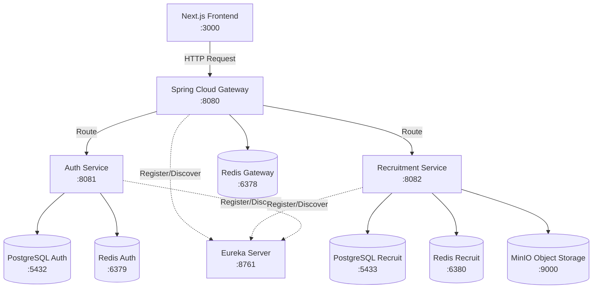
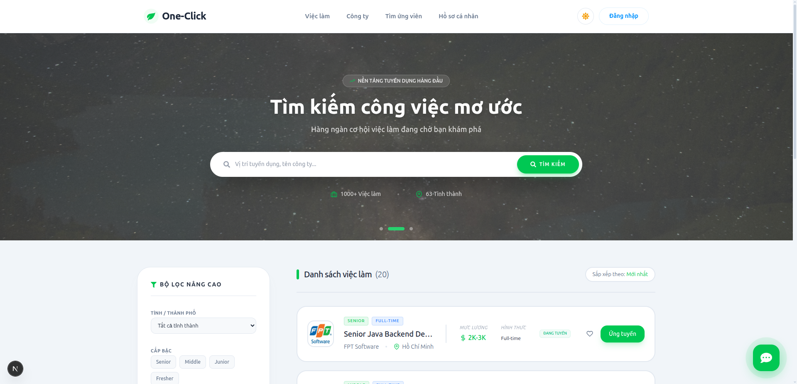
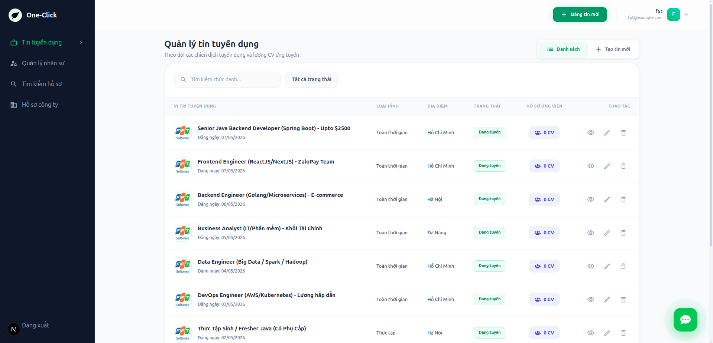
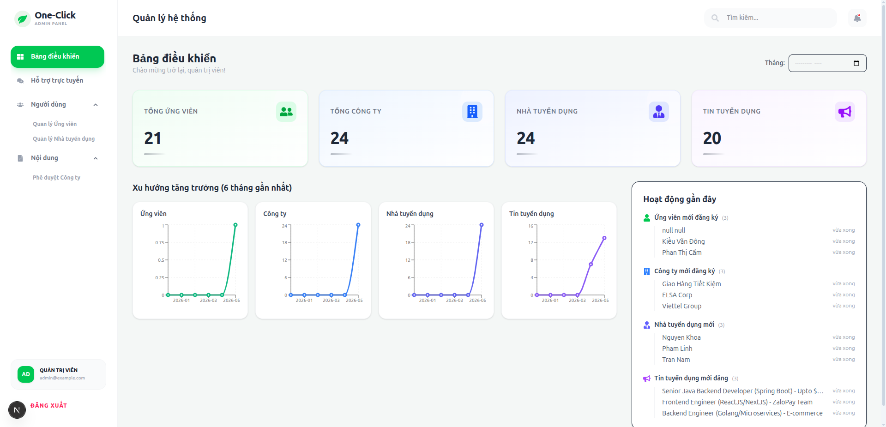
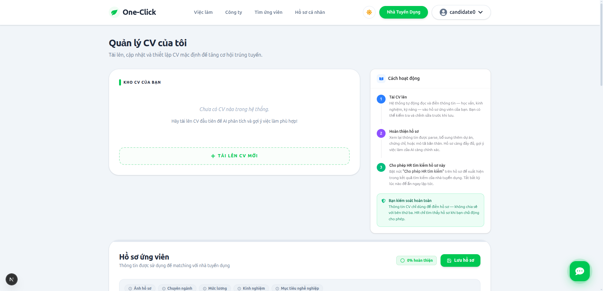
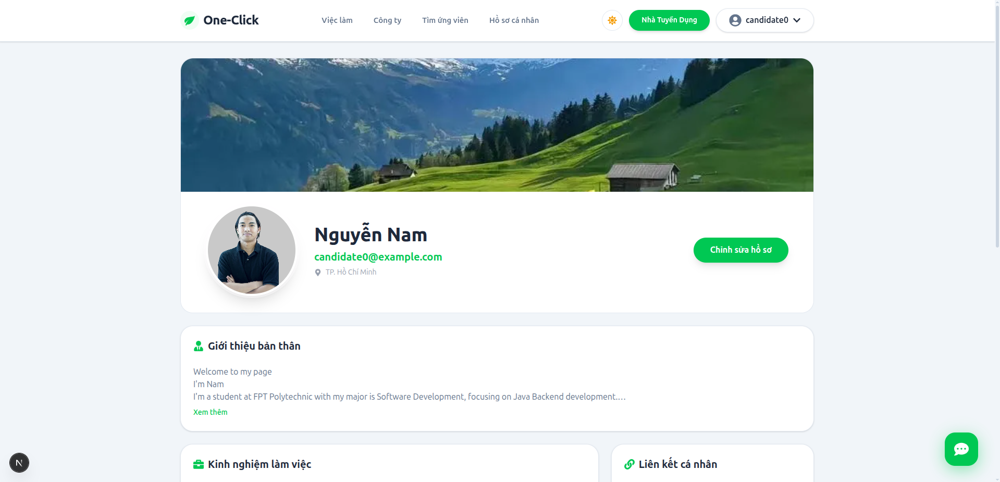

# OneClick Platform 🚀

[](https://java.com/)
[](https://spring.io/projects/spring-boot)
[](https://nextjs.org/)
[](https://react.dev/)
[](https://www.docker.com/)

Đây là repository cấu hình tổng (Home Repo) của dự án **OneClick Platform**. Repository này quản lý toàn bộ cấu hình hạ tầng và cho phép khởi chạy hệ thống Microservices chỉ với một lệnh duy nhất.

## 📐 Kiến Trúc Hệ Thống



## 🧩 Danh Sách Các Services

| Service Name | Công Nghệ | Port | Mô tả | Repository |
|--------------|-----------|------|-------|------------|
| **Auth Frontend** | Next.js / React | `3000` | Giao diện người dùng | [OneClick-authService-fe](https://github.com/Shinx99/OneClick-authService-fe) |
| **API Gateway** | Spring Cloud Gateway | `8080` | Điểm vào của mọi API, xử lý route | [OneClick-gatewayService](https://github.com/Shinx99/OneClick-gatewayService) |
| **Auth Backend** | Spring Boot | `8081` | Quản lý User, Authentication (JWT) | [OneClick-authService-be](https://github.com/Shinx99/OneClick-authService-be) |
| **Recruitment Backend** | Spring Boot | `8082` | Quản lý việc làm, CV, ứng viên | [OneClick-recruitmentService-be](https://github.com/Shinx99/OneClick-recruitmentService-be) |

*Các thành phần hạ tầng (Eureka, PostgreSQL, Redis, MinIO) được cấu hình tự động thông qua Docker Compose.*

## 📸 Giao Diện Ứng Dụng (Screenshots)

Dưới đây là một số hình ảnh thực tế của hệ thống OneClick Platform (bạn hãy thay thế đường dẫn ảnh bằng ảnh thật của dự án):

### 1. Trang Chủ (Home)


### 2. Trang Tuyển Dụng


### 3. Trang Quản Lý của Nhà Tuyển Dụng (Recruiter Dashboard)


### 4. Trang Quản Lý của Admin (Admin Dashboard)


### 5. Trang Quản Lý CV (CV Management)


### 6. Trang Hồ Sơ Người Dùng (User Profile)


## ⚙️ Yêu Cầu Hệ Thống

- **Git** (Để clone source code)
- **Docker & Docker Compose**
- Ít nhất **4GB RAM** trống.

## 🚀 Hướng Dẫn Cài Đặt Nhanh

Chỉ với 3 lệnh đơn giản, hệ thống sẽ tự động được tải về, thiết lập và chạy:

```bash
# 1. Cấp quyền thực thi cho các script (Linux/macOS)
chmod +x *.sh

# 2. Tạo file biến môi trường và sửa đổi (tuỳ chọn)
cp .env.example .env

# 3. Khởi chạy toàn bộ hệ thống
./oneclick.sh start
```

## 🛠 Cách Sử Dụng Master Script (`oneclick.sh`)

Sử dụng script `./oneclick.sh [command]` để điều khiển hệ thống:

- `start`: Tự động clone các services, build image và chạy toàn bộ container.
- `stop`: Dừng toàn bộ hệ thống (có thể tùy chọn xóa hoặc giữ dữ liệu).
- `restart`: Khởi động lại toàn bộ hệ thống.
- `build`: Thực hiện build lại các Docker images (dùng khi code thay đổi).
- `update`: Kéo (pull) code mới nhất từ tất cả các repository con.
- `status`: Xem trạng thái các containers đang chạy.
- `logs`: Xem logs (thời gian thực) của tất cả services.
- `clean`: **NGUY HIỂM** - Xóa sạch container, network và các volumes (xóa database).

## 📚 Tài Liệu Chi Tiết

- [Kiến trúc hệ thống](docs/architecture.md)
- [Hướng dẫn cài đặt chi tiết](docs/setup-guide.md)